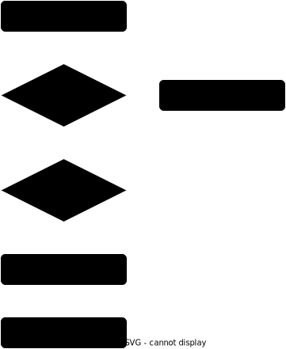

# ECE3314-DataStructure
## [[ECE3314] Data Structure - 2022 Spring Semester](http://abeek.inha.ac.kr/ReportCurrinfo.aspx?yearterm=20221&haksu_no=ECE3314&bunban=001)

Refer to ['Fundamentals of Data Structure in C' 2/E (Horowitz, 2008, Sillicon Press)](https://www.kyobobook.co.kr/product/detailViewEng.laf?ejkGb=ENG&barcode=9780929306407) (ISBN:9780929306407)


## Index

0. C Language Review (Array, Pointer, Structure)
1. Introduction: Algorithm and Data Organization
2. Arrays
3. Stacks and Queues
4. Linked Lists
5. Trees
6. Graphs
7. Internal Sorting
8. External Sorting
9. Hashing

## Development Environment
```
Operating System    : Ubuntu 20.04.4 LTS
Compiler            : gcc 9.3.0
Build/Host/Target   : x86_64-linux-gnu
```

### Requirements
```sh
sudo apt install build-essential    # including gcc, g++, standard libraries and make
sudo apt install gdb                # GNU Debugger
```

### Makefile
```makefile
CC = gcc
ifeq ($(RELEASE),1)         # Command "make RELEASE=1" for Release Build
CFLAGS = -O2 -DNDEBUG -c
LDFLAGS = -O2 -DNDEBUG -o
else                        # Command "make" for Debug Build
CFLAGS = -c -g -O0 -DDEBUG -W -Wall
LDFLAGS = -O0 -DDEBUG -W -Wall -o
endif
SRCS = $(notdir $(wildcard *.c))
OBJS = $(SRCS:.c=.o)
TARGET = a.out              # Set the name of executable output file
 
$(TARGET): $(OBJS)          # Linking object file w/ dynamic library
	$(CC) $(LDFLAGS) $(TARGET) $(OBJS)

%.o: %.c %.h                # Compile C source w/ header file
	$(CC) $(CFLAGS) $<

run:                        # Command "make run" to execute generated output.
	./$(TARGET)

clean:                      # Command "make clear" to remove all the intermediate and output file.
	rm *.o $(TARGET)
```

## Assignment

Submit compressed zip file including:

1. Source Code file(w/ appropriate comment as shown example below)

2. Report in docx or hwp format that includes:
    - captured image of executed result in terminal windows
    - explanation or analysis of algorithm
        - time complexity
        - space complexity

### Comment Example

1. File Head Comment
```c
/*********************************************************************
 * File Name            : main.c
 * Author               : Kang, Jun Gu
 * Student ID           : 1218XXXX
 * Date                 : 2022.02.28
 * Operating System     : Ubuntu 20.04.4 LTS
 * Compiler             : gcc 9.4.0
 * Build/Host/Target    : x86_64-linux-gnu
 *********************************************************************
 * version      : 1.0.0
 * description  : ...
 * etc...
 *********************************************************************/
```

2. Function Head Comment
```c
/*********************************************************************
 * TMatrix :: _InsertNode
 * description....
 *********************************************************************
 * Input    : Node* (Insert node)
 *            Node* (Column node before insert node)
 *            Node* (Row node before insert node)
 * Output   : int   (1: success)
 *                  (0: fail) 
 *********************************************************************/
```

3. Inline comment
```c
/*****************************Row insert*****************************/
    if(pRowPos->pNextRow != pRowPos) {
        pTemp->pNextRow = pRowPos->pNextRow;        // pTemp set next row
        if(!(pRowPos->pNextRow->bHead)){
            pRowPos->pNextRow->NodeItem.pPrevRow = pTemp;
        }                                           // end of if
    }                                               // end of if
    else
        pTemp->pNextRow = pRowPos;                  // pTemp set next row
    
    pTemp->NodeItem.pPrevRow = pRowPos;             // pTemp set previous row
    pRowPos->pNextRow = pTemp;
/**************************End of row insert**************************/
```

### Report Example

1. Algorithm - pseudo code
```
FixHeap(Node *root, Key k){
    Node vacant, largerChild;
    vacant = root;
    while( vacant is not leaf ) {
        largerChild = the child of vacant with the larger key;
        if( k < largerChild’s Key ) {
            copy lagerChild’s key to vacant;
            vacant = largerChild;
        }
        else exit loop;
    }
}
```
2. Algorithm - Flow Chart (Each function)



Draw flow chart at [**draw.io**](https://draw.io)